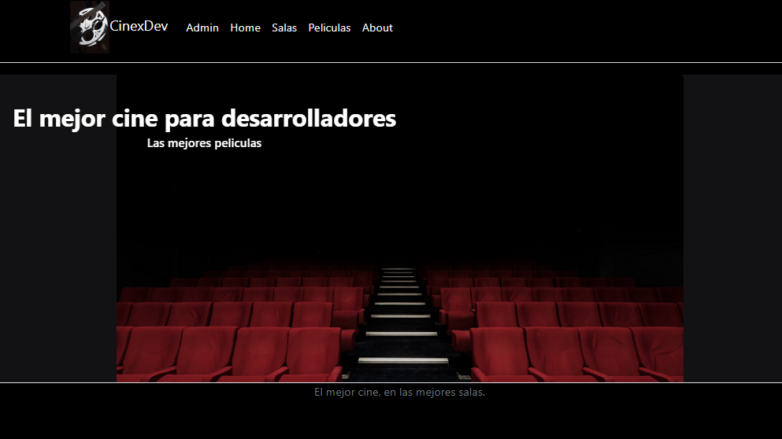
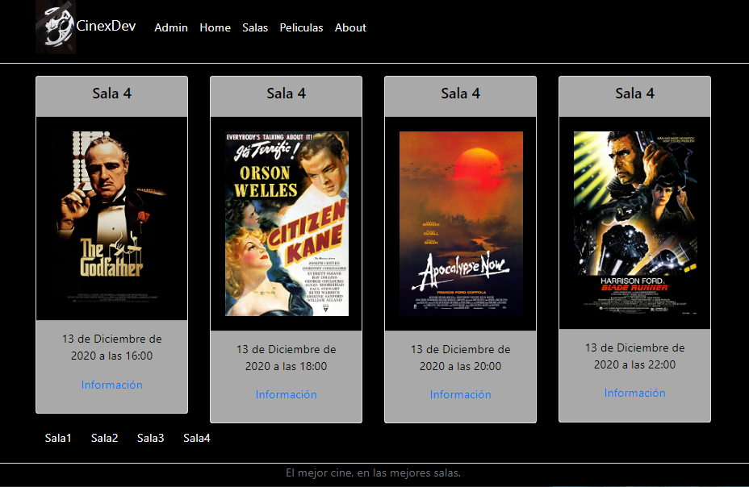
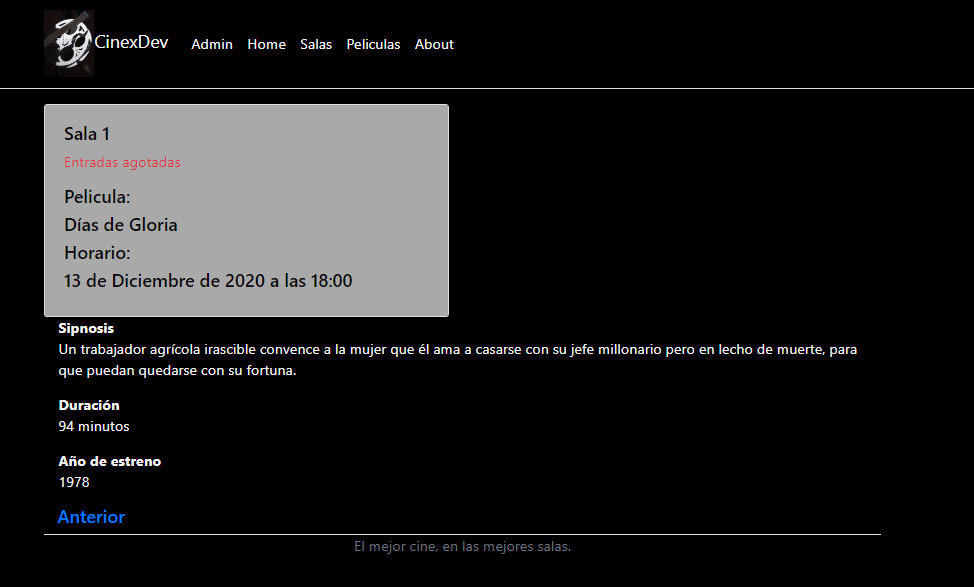

# CinexDev

Proyecto aplicación web para salas de cine

Este proyecto corresponde al primer examen del curso **Python Web Programmer** realizado en **Intecssa**.
Se utilizará el *framework* **Django** y la base de datos **PostgreSQL**.

Objetivos:
* Crear una base de datos.
* Modificar la administración de la aplicación.
* Crear las páginas correspondientes a Home, Salas, Peliculas y About.
* Utilizando el **Modelo Vista Controlador** dar contenido a la aplicación y maquetarla.

# Capturas

